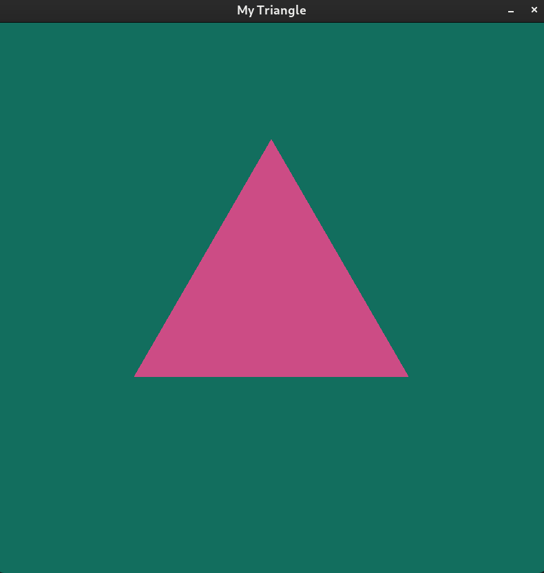

# OpenGL demo repo

## Dependencies

* glad: build from CMakeLists.txt in `${project_folder}/glad`
* glfw3
* stb library: for Fedora Linux `sudo dnf install stb*", other platforms go check out [stb library](https://github.com/nothings/stb)
* glm(OpenGL Mathematics): for Fedora Linux `sudo dnf install glm-devel" , other platforms go check out [glm library](https://github.com/g-truc/glm)
* CMake

build the program
`chmod +x build.sh clean.sh`
`./build.sh`

execute the program in current folder(OpenGL)
`./build/bin/1_create_window`

* Camera interactive logics(starts at section 4)

| Key                               | Effect                                        |
| --------------------------------- | --------------------------------------------- |
| WSAD                              | Move forward, backward, leftward, rightward   |
| Space                             | Move upward                                   |
| Ctrl                              | Move downward                                 |
| Press mouse left key + drag mouse | Focus on camera and change the angle of  view |

| Section                                           | Screenshots                                                  |
| ------------------------------------------------- | ------------------------------------------------------------ |
| 1: Plain window                                   |  |
| 2: Plain triangle                                 |  |
| 3: Rotating pyramid                               |  |
| 4: Interactive camera                             |  |
| 5:Lighting                                        |  |
| 6: Specular maps                                  |  |
| 7: Types of light                                 | 

 |
| 8: Mesh & Model(glTF)                             |  |
| 9: Stencil buffer/ Culling faces/ Post-processing | 
          
 |

