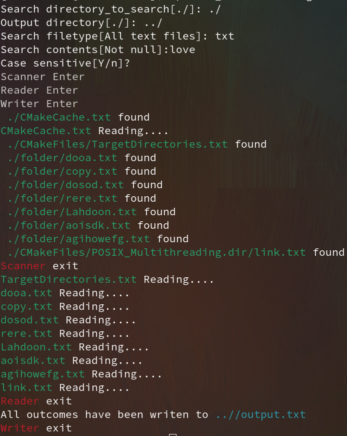

Self-paced coding demos

- [X] [File Contents Search/MultiThreading: WINAPI/POSIX version ](./MultiThreading/README.md):(>=C++17) Search targeting string from all readable files under a directory. Then output where the matched strings are in those files. e.g.(row number, column number)

<table>
  <tr>
     <td>WinAPI console</td>
     <td>WinAPI output</td>
  </tr>
  <tr>
    <td></td>
    <td></td>
  </tr>
    <tr>
     <td>POSIX console</td>
     <td>POSIX output</td>
  </tr>
  <tr>
    <td></td>
    <td></td>
  </tr>
 </table>
